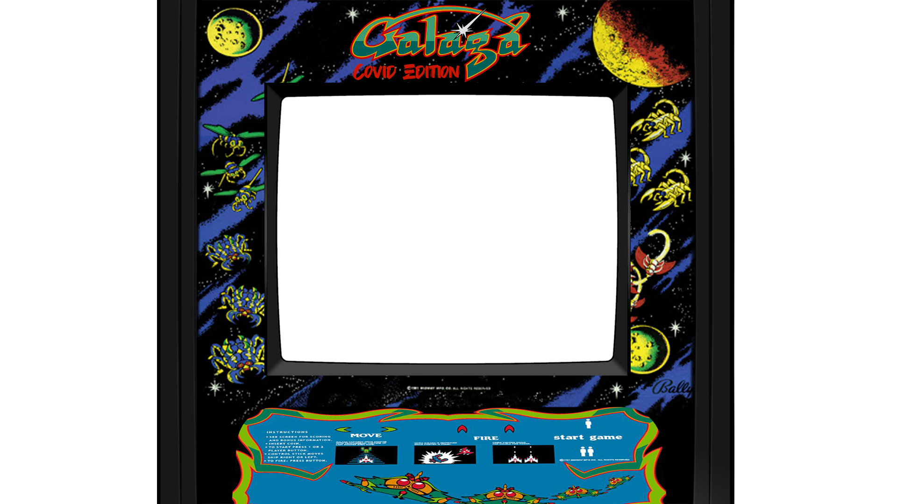
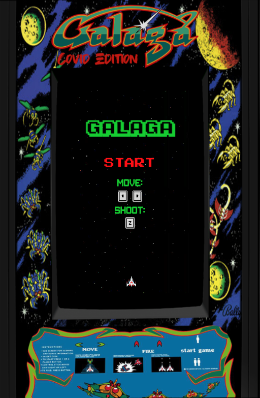
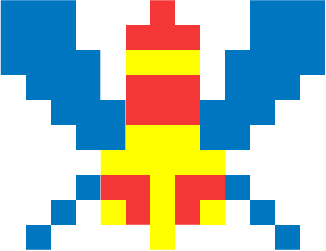

# Covid-Galaga
This is my version of Galaga that is relevant to 2020. It was made purely with HTML, CSS and Javascript.

## Greetings!
Welcome to Covid-19 Galaga! Growing up, I have always had the priviledge of being immersed in video games. My family was able to buy me and my brother all of the new consoles that came out. Most found to my memory, the Playstation 3. However, even though I always had the consoles with the best graphics and playability, there was always one game that I would play no matter what: Galaga. I loved the simplicity and the thrill that it had, despite being so pixelated and old (to me). 
With that being said, I wanted to challenge myself and make my own version of Galaga as a game project for myeahy General Assembly bootcamp. Additionally, I wanted to make it relevant with the times (2020). At the moment, we are not fighting alien invaders, however, we are fighting a deadly virus. 
So join along in my journey of recreating my childhood and maybe yours too!

### Step 1
The first step into the journey of my project was making the overlay to my game. I have immense experience with Adobe Photoshop so this came easy. I found all of the assets for my overlay and constructed a png with a classic Galaga design.
I finished this off with a "covid edition" at the top!
One of my main goals is to make this game accessible for mobile, so creating a responsive webpage was a big emphasis for me.



### Step 2
I had a huge plan that I wanted to execute but it didn't go quite as planned. I had trouble adding a grid into my overlay and so instead, I made the grid first, using an older canvas game that I worked on with a pre-made grid to try to trouble-shoot it that way. After successfully making my game grid, I was finally able to add on a new overlay that was edited to fit the canvas. After that I created a start menu using HTML and an event listener!
A highlight for this step was creating a never-ending panning background using requestAnimationFrame! Below is the code for that.

```javascript
    let bg = new Image();
    bg.src = 'assets/bg.png';

    window.onload = function() {
        let bgHeight = 0;
        let scrollSpeed =  1;

        function loop () {
            ctx.drawImage(bg, 0, bgHeight);
            ctx.drawImage(bg, 0, bgHeight - game.height);
            ctx.globalCompositeOperation='destination-over';
            bgHeight += scrollSpeed;

            if (bgHeight == game.height)
                bgHeight = 0;

            window.requestAnimationFrame(loop);
        }
        loop();
    }
```



### Step 3
In life, I always wished there was just one answer to my problems. In the same way, I wish there was one code to solve my coding problems. Hoevever, code is GREAT in that there are so many different ways to do the same thing. That is both a sarcastic statement and one of optimism. It's great knowing that I don't have to stick to one way of thinking!
My next step was probably the most challenging: creating the game mechanics. 
It took me about 5 hours to figure out/Googling (the problem with using Google is that there are a lot of answers. Too many sometimes. It's important to understand the concept of their code rather than just copying and pasting it because it won't necessarily work in your javascript) the right way to code a shooting function and another 2 hours unsuccessfully trying to reduce the fire rate. Below is part of the code that allowed me to execute it. On top of that, it took a whole day just to figure out how I wanted to code the algorithms for the enemy's movements. Through hours and hours of Google searching, I found out that making an array and pushing new objects was the best way to create multiple of the same object!

```javascript
    let missileTotal = 10;
    let missiles = [];

        if (controller.shoot && missiles.length <= missileTotal) {
        missiles.push([hero.x + 20, hero.y - 20, 5, 15])
    }  

    function drawMissile() {
        if(missiles.length)
        for(let i = 0; i < missiles.length; i++) {
        ctx.drawImage(missile, missiles[i][0], missiles[i][1], missiles[i][2], missiles[i][3]);
        }
    }

    const moveMissile = () => { 
        for(let i = 0; i < missiles.length; i++) {
            if(missiles[i][1] > -11) {
                missiles[i][1] -= 15;
            } else if (missiles[i][1] < -10) {
                missiles.splice(i, 1);
            }
        }
    }

    missile = new Image();
    missile.src = 'assets/missile.png'  
```

```javascript
    let enemies = [];
    let enemySize = 25;
    let speed = 5;

    function spawn() {
        enemies.push({x:Math.random()*game.width, y:-20}) 
    }

    function drawEnemy() {
        for(let i = 0; i < enemies.length; i++) {
            enemies[i].y += speed;
            ctx.drawImage(enemy, enemies[i].x - enemySize/2, enemies[i].y - enemySize/2, enemySize, enemySize);
        }
    }
```

### Step 4 
Step 4 is kind of an extention to step 3. After coding the enemies and missiles, I had to code the win/lose condition, when the enemy hits the player and when the missiles hit the enemies. This is where the real math took place. To figure out how to detect the hit, I was lucky enough to have a game that was linear. You'd only get hit from the top of the ship or from the top of the missile. 

```javascript
    if(dist < (hero.height + enemySize)/2 || hero.x < -10 || hero.x > 350
        || hero.y < 0 || hero.y > 600)  {
            enemies = [];
            hero.x = hero.y = 550;
            hero.alive = false;
            tryAgainBtn.style.display = 'block';
            score.style.display = 'none';
            highScore.style.display = 'none';
            oof.play();
    }
```

 

## Conclusion
I had a lot of fun making this game and I learned a lot about myself as a coder and my habits as a person. Everyday and night possibilities for solutions would run through my head. I'm excited to say that I've never really felt a passion like this before in my life. 
With that being said, I could not do everything perfectly. I soon realized when starting this project that Galaga is a lot more complex than I thought. The enemy animations are all thoroughly routed and was just something that I didn't have the time or ability to complete. However, something practical that I could have done better was using sprite sheets. I definitely tried in the beginning but gave up because it would take too much trial and error.
I definitely wanted to add more features like a ranking board and just more sound effects in general.
I am proud of my work and I want to celebrate the wins in this, but I know that I can always improve and am always trying to learn from my faults!